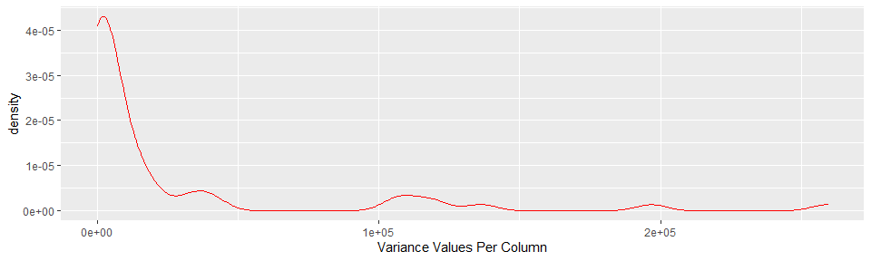

##### **A. Synopsis**
###### In this project, data from accelerometers on the belt, forearm, arm, and dumbell of 6 participants (whom performed barbell lifts correctly and incorrectly in 5 different ways) were used to predict the way someone is performing an exercise. Training and test datasets were retrieved from https://d396qusza40orc.cloudfront.net/predmachlearn/pml-training.csv, and https://d396qusza40orc.cloudfront.net/predmachlearn/pml-testing.csv, respectively. Full information on the dataset is available on http://web.archive.org/web/20161224072740/http:/groupware.les.inf.puc-rio.br/har

##### **B. Pre-Processing**

```r
read.csv("pml-training.csv", header = TRUE) -> rawtrain
read.csv("pml-testing.csv", header = TRUE) -> rawtest
```

###### Upon looking at the raw data, there are several columns with high number of missing values, which are useless and non-imputable; thus, removal of these columns was done.

```r
rawtrain[, which(colMeans(!is.na(rawtrain)) > 0.5)] -> rawtrain

while (ncol(rawtrain) >60) try({for (i in 1:ncol(rawtrain)) {if (mean(rawtrain[,i] %in% "") > 0.5) {rawtrain[,-i] -> rawtrain}}}, silent = TRUE)  

rawtrain[,-c(1:7)] -> rawtrain
suppressPackageStartupMessages(library(dplyr, quietly = TRUE))
   select(rawtest, all_of(names(rawtrain[,-ncol(rawtrain)]))) -> finaltesting
```

##### **C. Exploratory Data Analysis**

```r
suppressPackageStartupMessages(library(ggplot2, quietly = TRUE))
as.data.frame(apply(rawtrain[,-ncol(rawtrain)], 2, var)) -> checking; colnames(checking) = "var"
ggplot(checking, aes(x=var)) + geom_density(colour= "red") + labs(x= "Variance Values Per Column")
```

<!-- -->

###### By looking at the plot, the predictor variables have high variance and skewness. Thus, to reduce variance with similar bias, bootstrap aggregating was done. The training data was partitioned into 80% training set and 20% initial testing set.

##### **D. Bootstrapping Aggregating and Model Fitting**

```r
suppressPackageStartupMessages(library(caret, quietly = TRUE))
suppressPackageStartupMessages(library(gbm, quietly = TRUE))
trainer <- createDataPartition(rawtrain$classe, p=0.80, list = FALSE)
trainingset <- rawtrain[trainer,]
testingset <- rawtrain[-trainer,]
fitbag <- train(classe~., data = trainingset, method="treebag")
fitbag$results
```

```
##   parameter  Accuracy     Kappa  AccuracySD    KappaSD
## 1      none 0.9789484 0.9733735 0.004825069 0.00609991
```

###### Based from the results, our model has a 97.89 accuracy.
##### **E. Prediction with Initial Test Set**

```r
confusionMatrix(testingset$classe, predict(fitbag, testingset))$overall[c(1,6)]
```

```
##       Accuracy AccuracyPValue 
##      0.9882743      0.0000000
```

```r
confusionMatrix(testingset$classe, predict(fitbag, testingset))$table
```

```
##           Reference
## Prediction    A    B    C    D    E
##          A 1111    3    1    1    0
##          B   11  744    2    2    0
##          C    0    3  678    3    0
##          D    0    3    9  629    2
##          E    0    3    2    0  716
```

###### Our prediction has a 98.82% accuracy with p-value of 0. 

##### **F. Running the Model on the Final Test Set**

```r
predict(fitbag, finaltesting)
```

```
##  [1] B A B A A E D B A A B C B A E E A B B B
## Levels: A B C D E
```


